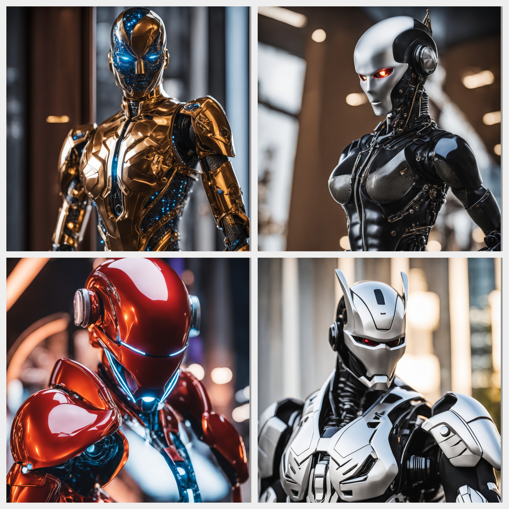
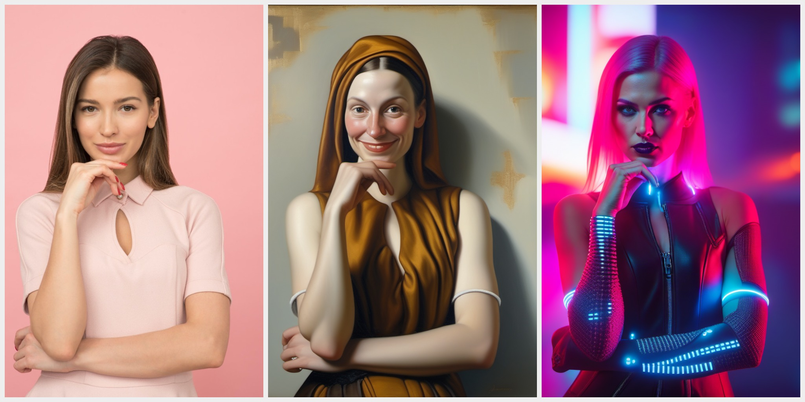

# SDXL-ComfyUI-workflows

This repository contains a handful of SDXL workflows I use, make sure to check the usefull links as some of these models,
and/or plugins are required to use these in ComfyUI.

## Useful links

  * [Stability AI](https://huggingface.co/stabilityai) on Huggingface: Here you can find all official SDXL models
    * [SDXL 1.0](https://huggingface.co/stabilityai/stable-diffusion-xl-base-1.0): The base model, this will be used to generate the first steps of each image at a resolution around 1024x1024.
    * [SDXL Refiner](https://huggingface.co/stabilityai/stable-diffusion-xl-refiner-1.0): The refiner model, a new feature of SDXL 
    * [SDXL VAE](https://huggingface.co/stabilityai/sdxl-vae): Optional as there is a VAE baked into the base and refiner model, but nice to have is separate in the workflow so it can be updated/changed without needing a new model.
    * [Control-Lora](https://huggingface.co/stabilityai/control-lora): Official release of a ControlNet style models along with a few other interesting ones.
  * [OpenPose SDXL](https://huggingface.co/thibaud/controlnet-openpose-sdxl-1.0): OpenPose ControlNet for SDXL.
  * [ComfyUI](https://github.com/comfyanonymous/ComfyUI): Node based workflow manager that can be used with Stable Diffusion
    * [ComfyUI Manager](https://github.com/ltdrdata/ComfyUI-Manager): Plugin for CompfyUI that helps detect and install missing plugins.
    * [ComfyUI ControlNet aux](https://github.com/Fannovel16/comfyui_controlnet_aux): Plugin with preprocessors for ControlNet, so you can generate images directly from ComfyUI.
  * [Sytan SDXL ComfyUI](https://github.com/SytanSD/Sytan-SDXL-ComfyUI): Very nice workflow showing how to connect the base model with the refiner and include an upscaler. This was the base for my own workflows.
  * [ESRGAN Upscaler models](https://openmodeldb.info/): I recommend getting an UltraSharp model (for photos) and Remacri (for paintings), but there are many options optimized for various uses.

## Workflow for photographs

For photographs the refiner can be a huge boon. Here it is applied twice once as part of the initial image generation, 
once after the up-scaling step. This helps to create crisp images with a lot of detail. This workflow includes the 
Offset Noise Lora and the option to include an additional Lora (make sure to set the weights higher than zero to 
use this option) and an OpenPose ControlNet is included. 



Positive prompt used:
```
cinematic closeup photo of a futuristic android made from metal and glass. Neon lights, hdr, f1.8, intricate details, nikon, canon,
```
Negative prompt used:
```
noise, grit, dull, washed out, low contrast, blurry, deep-fried, hazy, malformed, warped, deformed, grayscale, illustration, painting
```

**Workflow:** [./workflows/photography_workflow.json](./workflows/photography_workflow.json)

## Workflow for artistic/painterly styles

While for photographs the refiner helps, the opposite seems true when an artistic style is desired. 
In this workflow the refiner has been removed and CLIP skip has been added. 

**Workflow:** [./workflows/painterly_style_workflow.json](./workflows/painterly_style_workflow.json)

## Dual ControlNet Workflow

Sometimes it pays off to combine to ControlNets, the Depth and Canny models I like to combine as one gets the overall
shape, while the other can get details. Combined this can yield great results. The basic workflow does not include
the refiner, the other one does.

Below is an example with the reference image on the left, in the middle on done using the basic workflow and on the right
one with the refiner workflow.



**Basic Workflow:** [./workflows/dual_controlnet_basic.json](./workflows/dual_controlnet_basic.json)
**Refiner Workflow:** [./workflows/dual_controlnet_refiner.json](./workflows/dual_controlnet_refiner.json)
